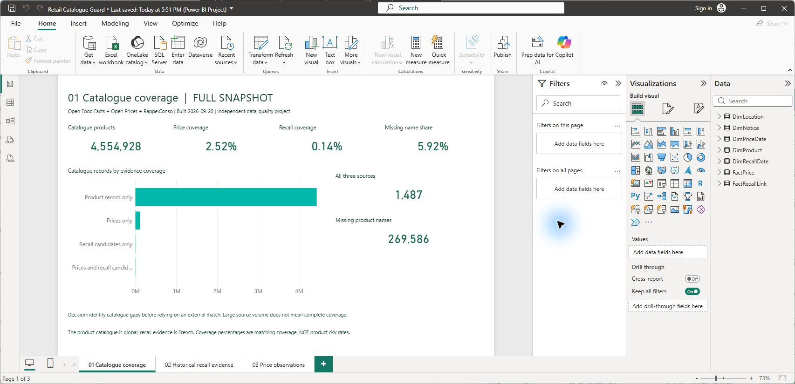
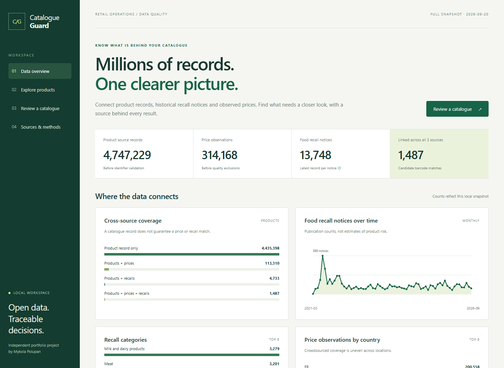
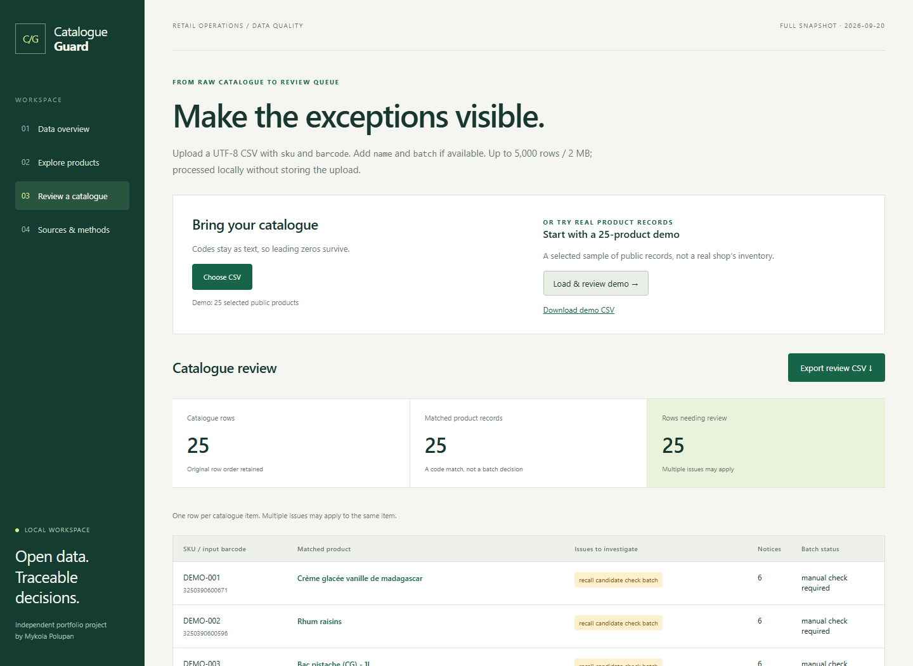
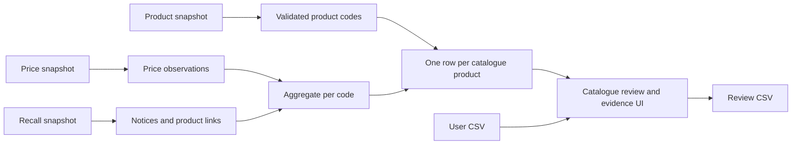

# Retail Catalogue Guard

[](https://github.com/Home-ad/retail-catalogue-guard/actions/workflows/tests.yml)

**Power BI reporting and a local catalogue review tool connecting product records, historical recall notices and observed prices.**

A purchasing team receives a spreadsheet of product codes. The useful question is not simply whether a code exists: is the code valid, does the description agree, are there historical recall candidates, and what evidence should a person check next?

Catalogue Guard turns that spreadsheet into a source-linked review queue. It also exposes the coverage and limitations of the underlying data, so an impressive row count does not hide weak matches.

## Open the Power BI report

Download the full-data **PBIX** and optional refresh-data package from [the Power BI release](https://github.com/Home-ad/retail-catalogue-guard/releases/tag/v1.1.0). Open the PBIX in Power BI Desktop; the imported snapshot is already inside it. No Python or account is needed to view the local report. Publishing to the Power BI service is not required.

The report has three English pages, seven tables, six checked relationships and 17 DAX measures. It contains the full 4,554,928-product catalogue plus 27,099 codes with evidence but no catalogue card. [Build instructions and model](powerbi/README.md) · [Critical analytical audit](docs/analytical-audit.md).



The web interface below is an additional workflow for uploading a supplier CSV and inspecting original source evidence.



## Recorded full build

The 20 September 2026 snapshot contains **4,747,229 product source records**, **314,168 price observations** and **18,648 recall source records**. After validation and deduplication, the working catalogue has **4,554,928 products**, **302,866 accepted prices** and **13,748 food recall notices**. **1,487 products** have candidate links across all three sources.

The full local build took **50.2 seconds after downloading** on the development machine. A generated test catalogue containing 5,000 distinct real product codes was reviewed in 2.518 seconds. These are single-run observations, not hardware-independent performance promises. [Counts, exclusions and checks](docs/validation.md) are published alongside the [machine-readable build report](docs/full-build.json).

## What you can do

- Explore product names, brands and barcodes, with filters for recall candidates, description conflicts and observed prices.
- Upload a UTF-8 CSV and find invalid codes, duplicate SKUs, missing records, description conflicts and historical recall candidates.
- Open the original recall notice and its product/batch text next to the product record.
- Inspect observed price history, keeping currency and reported price unit separate.
- Export a spreadsheet-safe review report with source links and the original row order.
- Inspect source manifests, coverage charts and the rules used to build the database.

This is an independent portfolio project, not a production safety service or paid client engagement. A barcode match is a **candidate** for review. It does not establish that a particular batch is affected. “No notice found” does not establish safety.

## Try the real-data demo

64-bit Python 3.12 or newer is required for the pinned dependencies. Python 3.12 is used for the recorded validation. The demo is bundled, so you do not need an API key, a paid subscription, a GPU or the full 8 GB product download.

```sh
git clone https://github.com/Home-ad/retail-catalogue-guard.git
cd retail-catalogue-guard
python -m venv .venv
```

Activate the environment:

```powershell
.venv\Scripts\Activate.ps1
```

On macOS or Linux:

```sh
source .venv/bin/activate
```

Then:

```sh
python -m pip install -r requirements-lock.txt
python -m pip install -e . --no-deps
catalogue-guard --data-dir data-demo demo
catalogue-guard --data-dir data-demo serve
```

Open **http://127.0.0.1:8765**. Choose **Review a catalogue → Load & review demo**. The demo is a purposeful selection of real public records, not a representative sample or a real shop's stock. Its dashboard clearly identifies the reduced scope.

The bundled demo contains 240 products, 7,334 price observations and 114 notices in approximately 0.36 MB of Parquet files. Open any flagged product to see its original notice, then export the review CSV. Full-dataset screenshots above and below are labelled by the interface's **FULL SNAPSHOT** indicator.



## Use the complete datasets

```sh
catalogue-guard fetch all
catalogue-guard build
catalogue-guard stats
catalogue-guard serve
```

The product Parquet download is about 7.9 GB. Reserve approximately 30–40 GB of free disk space for sources, derived tables and temporary files. That reserve is a planning allowance, not a measured peak requirement. DuckDB is configured with a 2 GB memory limit and four threads; total process memory can exceed the engine's configured limit. The initial download depends on your connection.

Downloads are stored locally and checksummed. Completed snapshots are reused only after checksum verification. A build uses a staging database, then replaces the database after successful validation. Stop the local server before rebuilding, particularly on Windows. To use a newer snapshot without overwriting a previous one, choose another `--data-dir` before `fetch` and `build`.

The bulk files replace millions of per-product API calls. The earlier feasibility study encountered HTTP 429 responses; the full pipeline therefore does not depend on the product API.

## Review your CSV

```csv
sku,barcode,name,batch
SHOP-001,3017620422003,Pâte aux noisettes,
```

Required columns: `sku`, `barcode`. Optional: `name`, `batch`. Preserve codes as text in your spreadsheet. The code above demonstrates the format; it does not assert any recall status.

```sh
catalogue-guard review my_catalogue.csv --output output/review.csv
```

The browser accepts at most 5,000 rows and 2 MB per upload. Uploaded catalogues are processed locally and are not persisted. The tool does not send them to an AI service. Batch information is retained in the output, but applicability remains a manual decision.

## Data and architecture

| Source | Role | Access |
|---|---|---|
| [Open Food Facts](https://huggingface.co/datasets/openfoodfacts/product-database) | Product identity, description, brand, packaging and categories | Bulk Parquet |
| [Open Prices](https://huggingface.co/datasets/openfoodfacts/open-prices) | Dated price observations, store metadata and evidence references | Bulk Parquet |
| [RappelConso](https://www.data.gouv.fr/datasets/rappelconso-v2-rappels-de-produits) | Historical product recall notices and identification blocks | Bulk JSON |



Python handles ingestion and rules; DuckDB handles joins and aggregations; FastAPI serves a local API; HTML, CSS and JavaScript render the interface and SVG charts. There is no cloud database, frontend build step, external font service or paid AI dependency.

Important implementation choices:

- Validate GTIN length and check digit before normalising to 14 characters; retain the raw code.
- Reject all-zero placeholders even when they satisfy the check digit. Structural validity still does not prove that a code was assigned to the item.
- Project the wide source Parquet into compact batches with PyArrow before analytical queries; perform Python identifier checks in batches instead of per-row database callbacks.
- Keep one record per canonical product code, selecting the latest source record and recording duplicate counts.
- Keep recall notices, recall-product relationships and price observations at separate grains.
- Aggregate each observation table before joining to the catalogue. Reconcile the resulting totals back to the matched source records.
- Treat non-overlapping description tokens as a conservative review flag. It is not a trained or accuracy-validated semantic classifier.
- Preserve unparsed recall blocks separately. Do not turn dates or batch identifiers into product codes.

See [the data contract](docs/data-contract.md), [validation results](docs/validation.md) and [source licenses](DATA_LICENSE.md).

## Tests

```sh
python -m pytest -q
```

Tests cover check digits, leading zeros, rejected identifiers, mixed batch text, many-to-many multiplication, repeat builds, catalogue row preservation, CSV formula injection, API validation and the end-to-end demo review workflow. Synthetic fixtures are confined to tests and do not contribute to scale claims.

## Known limits

- Recall history is not live stock status. Original notices and batch descriptions need a human review.
- Open Food Facts is community-maintained. A correct code can still have an incomplete or conflicting description.
- Prices are crowdsourced observations, not sales, revenue or a complete market price feed. Comparing current product metadata to old prices can cross packaging changes.
- Missing records, invalid codes and ambiguous identity are separate states. Absence of a match is not a negative safety finding.
- The recall parser intentionally favours reviewable candidates over aggressive extraction; recall coverage and matching accuracy have not been independently certified.
- This local application has no authentication layer. Its default bind address is localhost; do not expose it publicly without a separate deployment review.

Code: MIT. The bundled derived demo database: ODbL 1.0, with the original source attributions preserved. No receipt images or contributor identities are included.
