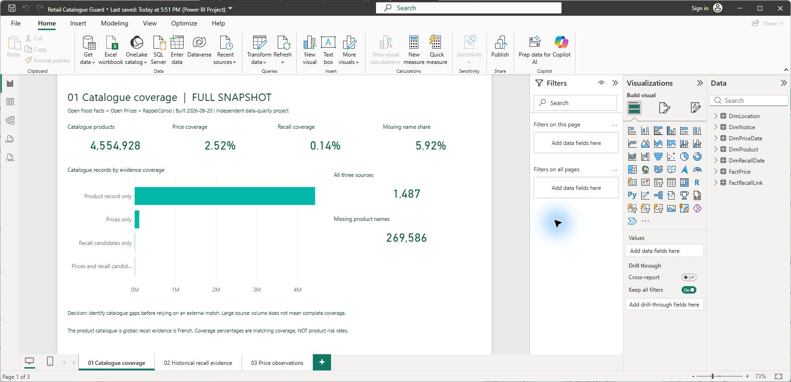

# Retail Catalogue Guard

[](https://github.com/Home-ad/retail-catalogue-guard/actions/workflows/tests.yml)

**A Python and SQL pipeline that turns public product, price and recall data into a reviewable catalogue, a local CSV-checking tool and a Power BI report.**

**Stack:** Python · DuckDB SQL · PyArrow · FastAPI · Power BI / DAX

Given a supplier spreadsheet, the tool checks product codes, missing records and description conflicts, then links historical recall candidates to their original notices. The main data-engineering problem is preserving one row per product while joining sources at different grains: prices and recall links are aggregated separately before the join, and totals are reconciled before the new database replaces the previous build.

This is a personal portfolio project, not a production safety service. A barcode match is a candidate for human review, not confirmation that a particular batch is affected.

## Review the project

- **Code and data decisions:** [data contract](docs/data-contract.md), [pipeline](src/catalogue_guard/pipeline.py), [join regression test](tests/test_pipeline.py), [analytical audit](docs/analytical-audit.md).
- **Report without Python:** download the full-data PBIX from [release v1.1.0](https://github.com/Home-ad/retail-catalogue-guard/releases/tag/v1.1.0) and open it in Power BI Desktop. The imported snapshot is included; no account or refresh is needed to view it. [Report and refresh guide](powerbi/README.md).
- **Run the workflow:** use the bundled [real-data demo](#try-the-real-data-demo), then upload a CSV and inspect or export the evidence. No API key or full dataset download is needed.



The Power BI report has three pages, seven tables, six single-direction relationships and 17 DAX measures. It retains evidence without a catalogue record and separates price comparisons by product, currency and reported unit. The local web tool adds product drilldown and CSV review: [overview](docs/overview.png) · [review screen](docs/review.png).

## Recorded result

The full snapshot was built on **20 September 2026**:

| Source | Input records | Accepted records |
|---|---:|---:|
| Open Food Facts products | 4,747,229 | 4,554,928 unique catalogue products |
| Open Prices observations | 314,168 | 302,866 price observations |
| RappelConso recalls | 18,648 | 13,748 food notices |

Only **1,487 catalogue products** have both price observations and recall candidates. The source sizes do not imply broad three-way coverage. The Power BI model also retains 27,099 codes with evidence but no catalogue card.

The full local build took **50.2 seconds after downloading**. Reviewing a generated CSV of 5,000 distinct real product codes took 2.518 seconds. These are single-run observations on the development machine, not cross-machine performance guarantees. [Counts, exclusions and checks](docs/validation.md) · [machine-readable build report](docs/full-build.json).

## Try the real-data demo

Use **64-bit Python 3.12 or newer**; the recorded validation uses Python 3.12. The bundled demo contains 240 products, 7,334 price observations and 114 notices in approximately 0.36 MB of Parquet files. It is a purposeful selection of real public records, not a representative sample or a real shop's stock.

```sh
git clone https://github.com/Home-ad/retail-catalogue-guard.git
cd retail-catalogue-guard
python -m venv .venv
```

Activate the environment on Windows:

```powershell
.venv\Scripts\Activate.ps1
```

Or on macOS / Linux:

```sh
source .venv/bin/activate
```

Install and run from the repository root:

```sh
python -m pip install -r requirements-lock.txt
python -m pip install -e . --no-deps
catalogue-guard --data-dir data-demo demo
catalogue-guard --data-dir data-demo serve
```

Open **http://127.0.0.1:8765** and choose **Review a catalogue → Load & review demo**. Open a flagged product, follow its original notice and export the review CSV. The interface labels demo and full-snapshot scopes separately. Stop the server with `Ctrl+C` before rebuilding its database, particularly on Windows.

### Review your own CSV

Save a UTF-8 file such as `my_catalogue.csv`. Required columns: `sku`, `barcode`; optional: `name`, `batch`. Preserve codes as text in your spreadsheet.

```csv
sku,barcode,name,batch
SHOP-001,3017620422003,Pâte aux noisettes,
```

The example illustrates the format; it does not assert any recall status. To review against the loaded demo:

```sh
catalogue-guard --data-dir data-demo review my_catalogue.csv --output output/review.csv
```

The web interface accepts up to 5,000 rows and 2 MB per upload. It preserves input order and batch text, distinguishes invalid codes from missing records, and flags duplicate SKUs and description conflicts. CSV exports escape spreadsheet formulas. Uploaded catalogues are processed locally, are not persisted and are not sent to an AI service.

## Build the complete datasets

After installation, with no server running:

```sh
catalogue-guard fetch all
catalogue-guard build
catalogue-guard stats
catalogue-guard serve
```

These commands use `data/`. To review a CSV against that full build, use `--data-dir data` instead of `--data-dir data-demo`. For Power BI export and model generation, follow the [Power BI guide](powerbi/README.md).

The product download is about 7.9 GB. Allow approximately 30–40 GB of free disk space for sources, derived tables and temporary files; this is a planning allowance, not a measured peak. DuckDB is limited to 2 GB of engine memory and four threads; total Python and Arrow process memory can exceed that limit.

Downloads are checksummed and reused only after verification. Builds use a staging database and replace the working database only after validation. Use a new `--data-dir` before fetching and building to preserve an earlier snapshot. Bulk files avoid millions of per-product API calls; the earlier feasibility study encountered HTTP 429 responses.

## Sources and implementation

| Source | Role | Access |
|---|---|---|
| [Open Food Facts](https://huggingface.co/datasets/openfoodfacts/product-database) | Product identity, description, brand, packaging and categories | Bulk Parquet |
| [Open Prices](https://huggingface.co/datasets/openfoodfacts/open-prices) | Dated prices, store metadata and evidence references | Bulk Parquet |
| [RappelConso](https://www.data.gouv.fr/datasets/rappelconso-v2-rappels-de-produits) | Historical recall notices and product identification blocks | Bulk JSON |

Python and PyArrow handle ingestion and validation; DuckDB handles joins and aggregations. FastAPI serves the local review UI, and the Power BI export supplies a separate analytical model. There is no cloud database or frontend build step.

- Validate GTIN length and check digit before normalising to 14 characters; retain the raw code and reject all-zero placeholders. Structural validity does not prove product identity.
- Project the wide product Parquet into compact batches; run Python identifier checks in batches rather than per-row database callbacks.
- Deduplicate catalogue products by canonical code, selecting the latest source record and recording duplicate counts.
- Keep notices, notice–product links and prices at separate grains. Aggregate before joining and reconcile counts to matched source records.
- Preserve ambiguous recall blocks for review; do not reinterpret dates or batch identifiers as product codes.
- Treat description-token conflicts as a conservative heuristic, without claiming measured semantic accuracy.

## Tests

With the same environment active, run:

```sh
python -m pytest -q
```

The tests cover check digits and leading zeros, rejected identifiers, mixed batch text, join multiplication, repeat builds, input row preservation, CSV formula escaping, API validation, demo loading and BI export/model checks. Synthetic fixtures are used only for tests and do not contribute to scale claims. [Recorded validation](docs/validation.md).

## Limits and licensing

- Recall history is not live stock status. Original notices and batch details require human review; no match does not establish safety.
- Open Food Facts is community-maintained, and descriptions can be incomplete or conflicting even for a valid code.
- Prices are crowdsourced observations, not sales, revenue or a complete market feed. Current product metadata and old observations may describe different packaging.
- The recall parser favours reviewable candidates over aggressive extraction. Matching accuracy and recall completeness have not been independently certified.
- The application has no authentication layer and binds to localhost by default. Public deployment and production concurrency have not been validated.

Development note: AI coding tools assisted the implementation. The documented checks describe what was exercised; no paid client deployment or business impact is claimed.

Code: [MIT](LICENSE). Bundled derived demo data: ODbL 1.0, with original source attributions. No receipt images or contributor identities are included. See [data licensing](DATA_LICENSE.md).
